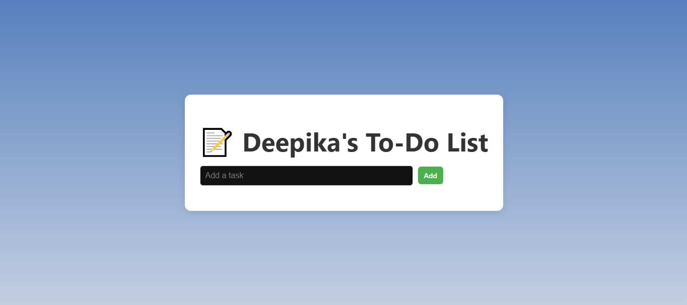
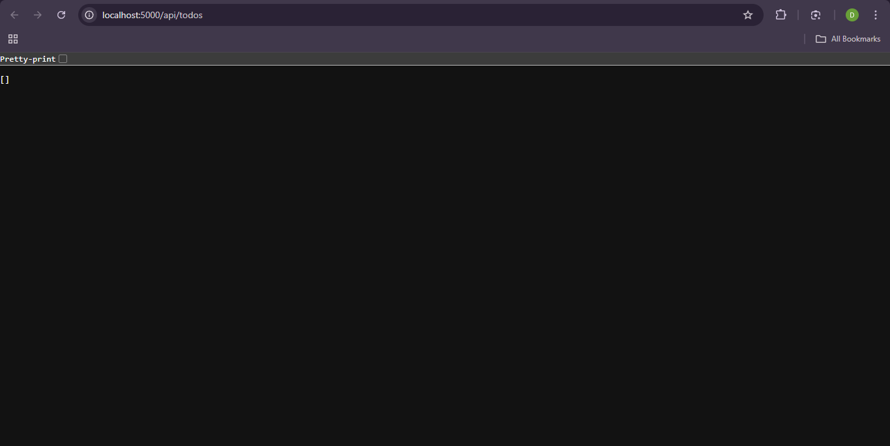
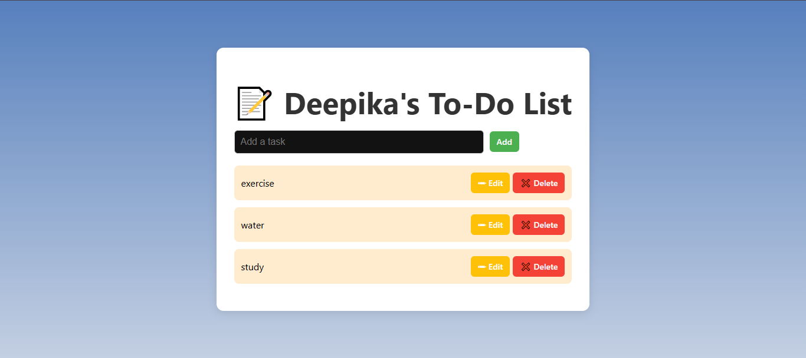
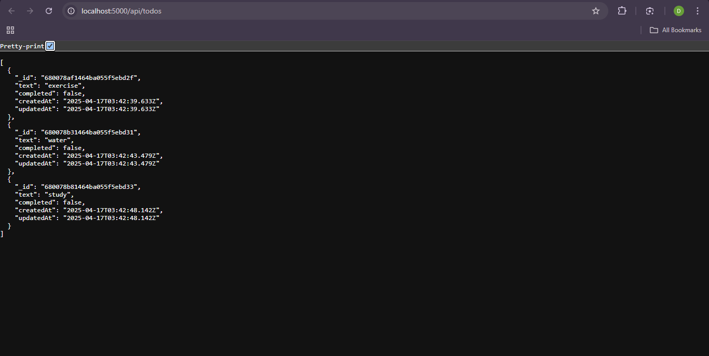
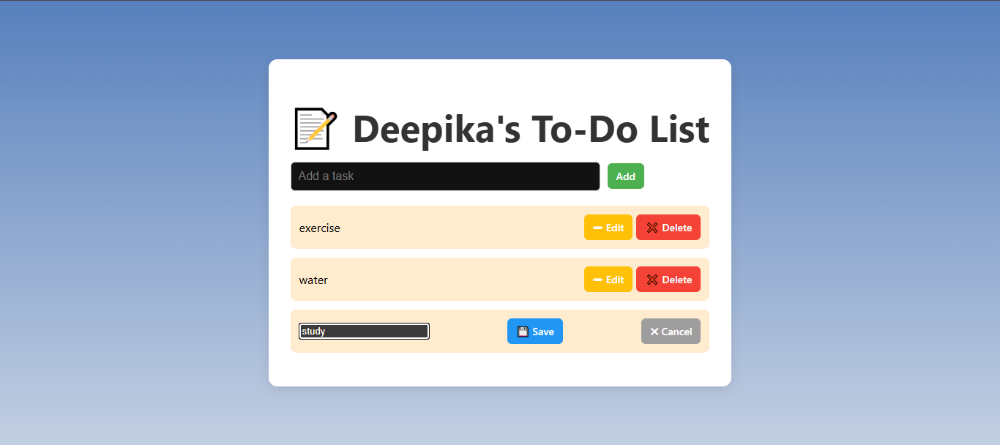
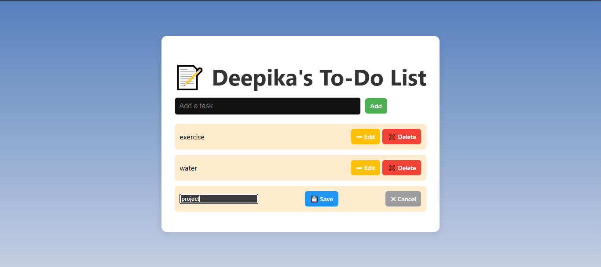
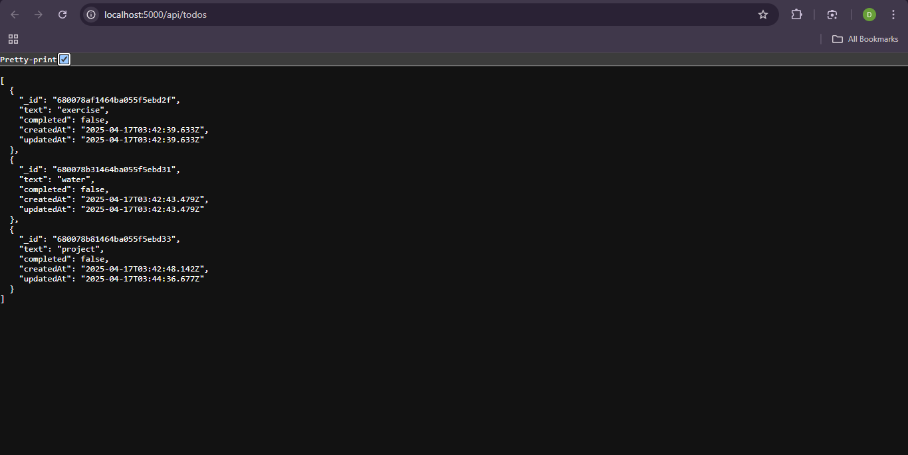
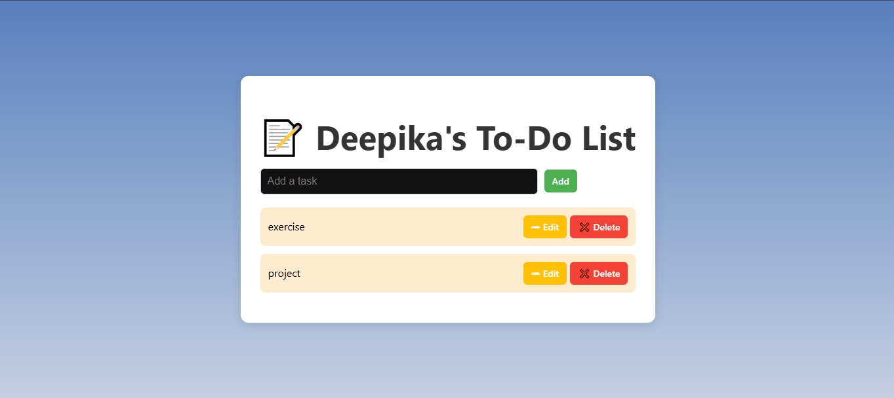
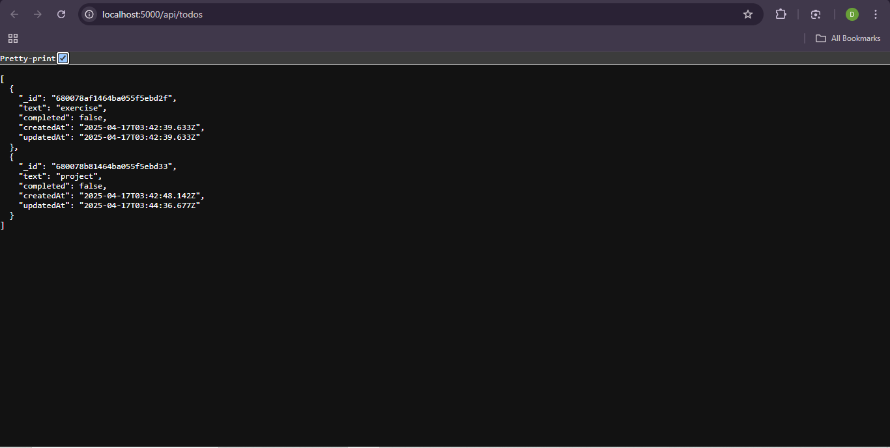

# To-Do App Using MERN Stack

This is a simple To-Do application built using the MERN stack (MongoDB, Express.js, React.js, Node.js). The application allows users to create, read, update, and delete tasks.

## Features

- Create a new task
- Read all tasks
- Update an existing task
- Delete a task

## Technologies Used

- MongoDB: NoSQL database to store tasks
- Express.js: Web framework for Node.js to handle API requests
- React.js: Frontend library to build the user interface
- Node.js: JavaScript runtime to run the server

## Installation

1. Clone the repository
2. Navigate to the project directory
3. Start the server
    >cd server
    >node server.js
4. Open a new terminal and start the client
    >cd client
    >npm run dev
5. Click on the link provided in the terminal to open the application in your browser 

## Output Screenshots

- Initial view:

- CREATE and READ:

- UPDATE:

- DELETE:

